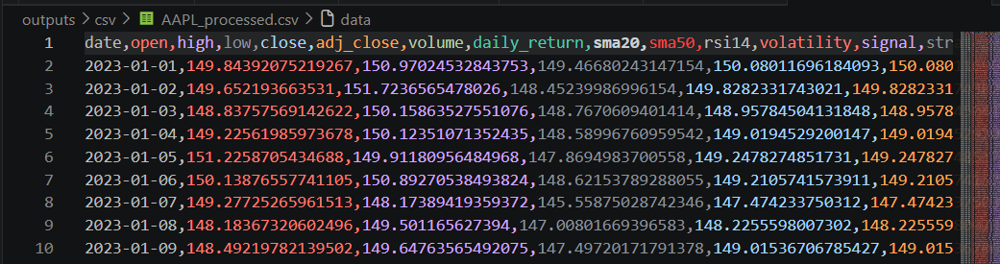
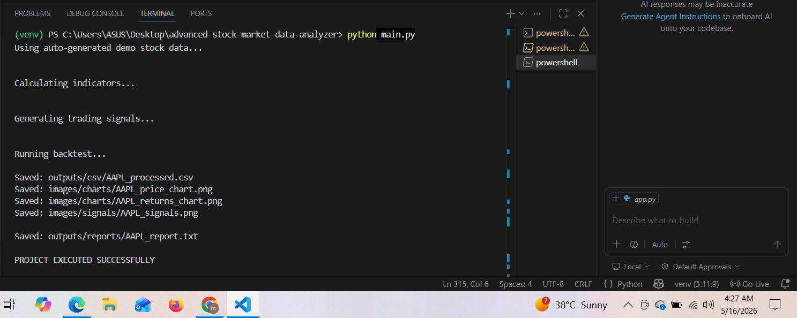
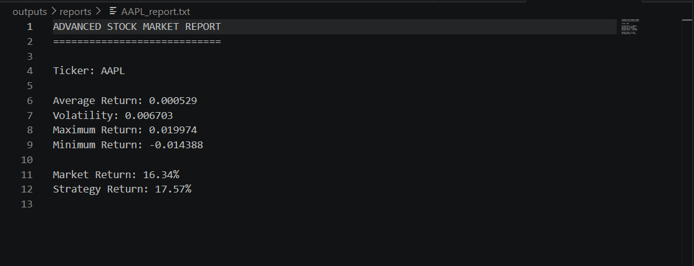
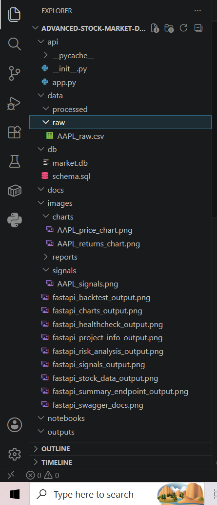
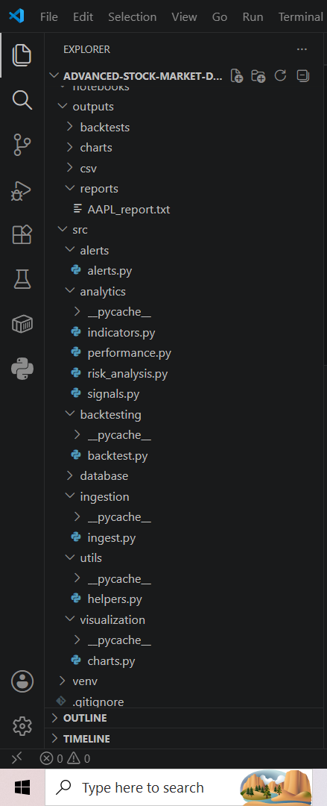
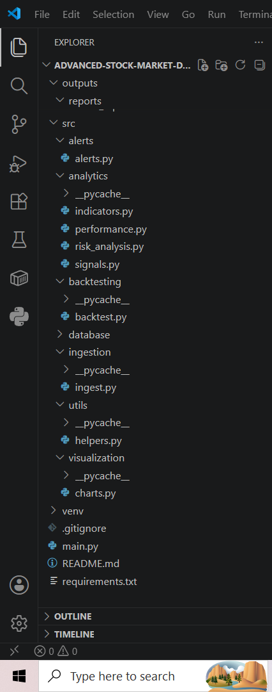

# Advanced Stock Market Data Analyzer


---

# Financial Market Intelligence & Backtesting Platform

An advanced Python-based stock market analytics platform that performs:

- Automated stock market data ingestion
- Technical indicator generation
- Trading signal detection
- Risk analysis
- Backtesting simulation
- Automated chart generation
- FastAPI backend integration
- Swagger API documentation
- Financial report generation

This project simulates a real-world FinTech analytics workflow used by:
- Quantitative Analysts
- Financial Analysts
- FinTech Engineers
- Backend Developers
- Investment Research Teams
- Algorithmic Traders

---

# Industry Relevance

Modern financial systems depend heavily on:
- real-time market analytics
- quantitative trading signals
- risk management systems
- technical analysis
- automated research pipelines

This project demonstrates practical skills used in:
- Python Development
- Financial Analytics
- Backend Engineering
- Quantitative Finance
- Data Analytics
- FinTech Development

---

# Key Features

## Data Engineering
- Automated Yahoo Finance stock data ingestion
- Automatic synthetic stock data fallback generation
- CSV export pipeline
- Data preprocessing

## Financial Analytics
- Daily return calculations
- Volatility analysis
- Moving averages
- Technical indicators
- Trend analysis

## Trading Intelligence
- Buy/Sell/Hold signal generation
- Strategy simulation
- Automated backtesting engine

## Visualization
- Price trend visualization
- Returns distribution charts
- Buy/Sell signal charts

## Backend Engineering
- FastAPI REST API
- Swagger UI documentation
- API health monitoring

---

# Project Architecture

```text
Stock Market Data
        ↓
Data Cleaning
        ↓
Feature Engineering
        ↓
Technical Indicators
        ↓
Trading Signals
        ↓
Risk Analysis
        ↓
Backtesting
        ↓
Visualization
        ↓
FastAPI Backend
        ↓
Swagger API Docs

Tech Stack
Technology	Purpose
Python	    Core Development
Pandas	    Data Processing
NumPy	    Numerical Computing
yFinance	Market Data Fetching
Matplotlib	Data Visualization
FastAPI	    Backend API
Uvicorn	    API Server
VS Code	    Development Environment

Folder Structure
advanced-stock-market-data-analyzer/
│
├── api/
│   ├── __init__.py
│   └── app.py
│
├── data/
│   └── raw/
│
├── images/
│   ├── charts/
│   ├── reports/
│   └── signals/
│
├── outputs/
│   ├── csv/
│   ├── reports/
│   └── backtests/
│
├── src/
│   ├── analytics/
│   ├── backtesting/
│   ├── ingestion/
│   ├── utils/
│   └── visualization/
│
├── main.py
├── requirements.txt
├── README.md
└── .gitignore
Installation

Clone Repository
git clone https://github.com/vyawaha/advanced-stock-market-data-analyzer.git

Navigate to Project Folder
cd advanced-stock-market-data-analyzer

Create Virtual Environment
Windows
python -m venv venv
venv\Scripts\activate

Install Dependencies
pip install -r requirements.txt

Run Main Project
python main.py

Run FastAPI Backend
uvicorn api.app:app --reload

Open Swagger API Documentation
http://127.0.0.1:8000/docs

Automatically Generated Outputs

The project automatically generates:

Processed stock CSV datasets
Trading signals
Financial analysis reports
Price movement charts
Returns analysis charts
Risk analysis
Backtesting summaries
API responses
Swagger documentation
Project Execution Output
Successful Terminal Execution

CSV Output Preview

Price Trend Chart


Returns Analysis Chart


Trading Signals Chart


CSV OUTPUT


EXECUTION OUTPUT


REPORT OUTPUT


PROJECT STRUCTURE




🚀 Swagger API Documentation
Swagger UI available at:
http://127.0.0.1:8000/docs

FastAPI Summary Endpoint
{
  "ticker": "AAPL",
  "latest_close": 189.23,
  "average_return": 0.0012,
  "volatility": 0.018,
  "max_close": 195.10,
  "min_close": 172.45
}

📊 FastAPI Health Check Endpoint
{
  "status": "ok",
  "message": "API is running successfully"
}

📈 FastAPI Stock Data Endpoint
[
  {
    "date": "2025-01-01",
    "close": 185.2,
    "sma20": 182.5,
    "sma50": 178.9
  }
]

📉 FastAPI Risk Analysis Endpoint
{
  "volatility": 0.021,
  "average_return": 0.0012,
  "max_drawdown": -0.15
}

💰 FastAPI Backtest Endpoint
{
  "strategy_return": 18.5,
  "market_return": 12.3,
  "trades": 34,
  "win_rate": 0.62
}

📡 FastAPI Signals Endpoint
{
  "signal": "BUY",
  "reason": "SMA20 crossed above SMA50"
}

📊 FastAPI Charts Endpoint
Charts saved locally in:
/images/charts/

ℹ  FastAPI Project Info Endpoint
{
  "project": "Stock Market Data Analyzer",
  "version": "1.0",
  "mode": "educational"
}

API Endpoints
Endpoint	    Description
/	API         Home
/health	        Health Check
/stock-data	    Processed Stock Data
/summary	    Stock Market Summary
/risk-analysis	Volatility & Risk Metrics
/signals	    Trading Signals
/backtest	    Strategy Backtesting
/charts	        Generated Charts Status
/project-info	Project Metadata

Sample Insights Generated
Market trend analysis
Long-term moving averages
Daily returns analytics
Risk volatility analysis
Buy/Sell signal identification
Historical backtesting
Automated financial summaries

Real-World Applications
FinTech analytics systems
Quantitative research pipelines
Investment research platforms
Trading analytics dashboards
Market monitoring systems
Risk management platforms
Financial reporting automation
Learning Outcomes

Through this project I learned:
Financial data engineering
Time-series analysis
Technical indicator calculation
Backtesting strategies
REST API development
FastAPI backend systems
Automated visualization
Financial analytics
Professional GitHub project structuring

Future Improvements
AI-powered stock forecasting
LSTM prediction models
Portfolio optimization
Docker deployment
Cloud deployment
Real-time streaming analytics
Multi-stock comparison dashboard
Advanced quantitative indicators

Disclaimer
This project is built strictly for:

educational purposes
learning financial analytics
portfolio demonstration

This project does NOT provide:

financial advice
investment recommendations
trading advice

Always perform independent financial research before making investment decisions.

Author
Muktai Vyawahare

Python Developer | Financial Analytics Enthusiast | FastAPI Developer | Data Analytics Learner

Support the Project

If you found this project valuable, consider giving it a star on GitHub.